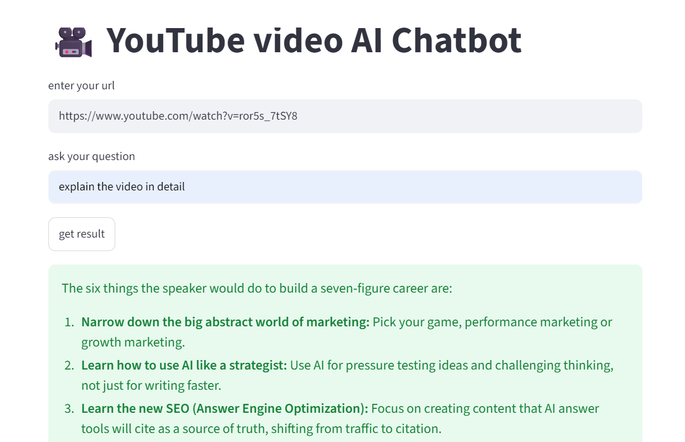

# YouTube AI Chatbot
## 🔗 Live Demo
[Try it here](https://youtube-ai-chatbot-sftbrgcjpmy3ez4zwwhnnv.streamlit.app/)
## 📸 Screenshot


## Problem Statement

YouTube videos, especially tutorials, lectures, podcasts, and interviews, often run 20-60+ minutes long, but viewers usually just need answers to specific questions — not the entire video. Manually scrubbing through a long video to find one relevant explanation wastes significant time.
This project solves that by letting users paste a YouTube video link and directly ask questions about its content. The chatbot reads the video's transcript and generates a precise, relevant answer instantly — without the user needing to watch any part of the video.
This is especially useful for students revising lecture content, professionals scanning long interviews/podcasts for key insights, or anyone trying to quickly verify if a video actually covers what they're looking for before committing time to watch it.

## Introduction

This project is a simple AI chatbot that answers questions from a YouTube video. It uses the video's transcript to generate answers. If the answer is not available in the transcript, the chatbot tells the user that it could not find the information.

## Technologies Used

* Python
* Streamlit
* LangChain
* Google Gemini API
* YouTube Transcript API
* python-dotenv

## How It Works

1. Enter the YouTube video URL.
2. Enter your question related to the video.
3. The application loads the video transcript.
4. Gemini reads the transcript and generates an answer.
5. The answer is displayed on the screen.

## Project Structure

```text
youtube-ai-chatbot/
│── app.py
│── .env
│── requirements.txt
│── README.md
```

## Installation

Install all the required libraries using:

```bash
pip install -r requirements.txt
```

## Run the Project

Run the Streamlit application:

```bash
streamlit run app.py
```

## What I Learned

* How to use LangChain with Google Gemini.
* How to load YouTube transcripts.
* How to create a Streamlit web application.
* How to use PromptTemplate and OutputParser in LangChain.

## Future Scope

* Add chat history.
* Improve the UI.
* Support more languages.
* Add video summarization.
* Allow users to upload videos.

## Author

**Aman Kumar**

B.Tech (2nd Year)
